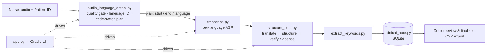

# MediVoice — Multi-Lingual Patient Intake Assistant

A voice-first patient intake tool for clinics in Nigeria. A nurse records (or uploads) a patient speaking **Hausa**, **Yoruba** or **English** — including mixed-language speech — and the app turns the recording into a structured English clinical note that a doctor then reviews, edits and signs off.

> **Clinical safety note.** Every note is AI-generated and **must be reviewed by a clinician**. The app is built around that: notes are saved as `pending_review`, the original transcript and the literal English translation are shown next to the note, and each field carries a verified quote from the patient's own words. It does not diagnose and does not recommend treatment.

---

## What it does

1. **Nurse** enters a Patient ID and records/uploads audio.
2. **Language detection** (Whisper) identifies the language(s) spoken. If the patient switches language mid-recording, the audio is split into language-labelled segments. The nurse is asked to choose a language **only if** detection fails.
3. **Transcription** — each segment is sent to the ASR model for its own language and the pieces are joined, in time order, into one transcript.
4. **Translation** — a literal English translation of the transcript is produced (separate from the note, so the doctor can compare).
5. **Structuring** — a local LLM writes a five-field note: *chief complaint, duration, severity, history, patient concerns*, plus a supporting quote for each field.
6. **Evidence check** — each quote is verified in code to be a real substring of the translation; unverifiable quotes are blanked rather than trusted.
7. **Keyword extraction** — symptoms, durations, severity words and body parts are pulled out for highlighting.
8. **Storage** — the visit is saved locally (SQLite) as `pending_review`.
9. **Doctor** opens the review queue, edits any field, and marks the visit reviewed. Visits can be exported to CSV.



## Supported languages

| Language | Speech recognition model | Notes |
|---|---|---|
| Hausa | `NCAIR1/Hausa-ASR` | Fine-tuned Whisper-Small |
| Yoruba | `NCAIR1/Yoruba-ASR` | Fine-tuned Whisper-Small |
| English | `openai/whisper-small` | No NCAIR English model; mainly present because patients code-switch into English |

Igbo was removed from scope. Some Igbo leftovers remain in the repo (see [Known issues](#known-issues)). This was done just in case you
wish to apply it yourself.

---

## Repository layout

The repository is flat — every module sits at the root. Detailed documentation for each file lives in separate folders.

| File / folder | Role | Docs |
|---|---|---|
| `app.py` | Gradio web app: dashboard, nurse intake, doctor queue and review | [docs/app.md](app/app.md) |
| `app_colab.py` | Three-line Colab launcher (`share=True`) | [docs/app_colab.md](app/app_colab.md) |
| `audio_language_detect.py` | Pre-ASR stage: audio quality gate, language ID, code-switch detection, transcription plan | [docs/audio_language_detect.md](nlp/audio_language_detect.md) |
| `transcribe.py` | ASR stage: segment-by-segment transcription with the right model per language | [docs/transcribe.md](transcribe/transcribe.md) |
| `structure_note.py` | Local LLM: translation, structured note, evidence verification | [docs/structure_note.md](notes/structure_note.md) |
| `extract_keywords.py` | LLM keyword extraction + HTML highlighting | [docs/extract_keywords.md](notes/extract_keywords.md) |
| `clinical_note.py` | SQLite schema, review queue, history, CSV export | [docs/clinical_note.md](notes/clinical_note.md) |
| `setup_models.py` | Pre-download script for models | [docs/setup_models.md](nlp/setup_models.md) |
| `test_language_segmentation.py` | Pytest suite for detection, segmentation and routing | [docs/test_language_segmentation.md](test_cases/test_language_segmentation.md) |
| `test_cases/` | Mixed pytest suites and manual model/benchmark scripts | [test_cases/README.md](test_cases/README.md) |
| `test_audio/` | Reference transcripts for ASR accuracy (WER) tests | [test_audio/README.md](test_audio/README.md) |
| `requirements.txt`, `.gitignore` | Dependencies; ignore rules (models, `*.wav`, local DB) | below |

---

## Getting started

### Prerequisites

- Python 3.10+ (the Colab logs show it running on 3.13)
- `ffmpeg` recommended (needed by `librosa`/`pydub` for compressed formats such as MP3)
- A Hugging Face account/token if any model you use is gated (`export HF_TOKEN=hf_...`)
- The LLM weights file `models/gguf/AMINI-q4_k_m.gguf` (see step 3)
- No GPU is required. The LLM is configured for CPU (2 threads); ASR uses CUDA automatically if a GPU with ≥1 GB free is present, otherwise CPU.

### Install and run

```bash
git clone -b test/merge https://github.com/greyvectorr/Multi-Lingual-Patient-Intake-Assistant.git
cd Multi-Lingual-Patient-Intake-Assistant

# 1. Python dependencies
pip install -r requirements.txt
# 2. The LLM runtime — NOT yet listed in requirements.txt (see Known issues)
pip install llama-cpp-python

# 3. Put the GGUF model file here (create the folders if needed):
#    models/gguf/AMINI-q4_k_m.gguf
#    (the repo does not say where to download it from — document the source here)

# 4. Run
python app.py
```

Whisper (language ID) and the NCAIR/OpenAI ASR models download automatically the first time they are used, so **the first intake after a cold start is slow**. Run one test recording before a live demo to warm everything up.

`app.py` launches with `share=True`, which opens a **public `gradio.live` link**. Change that call to `demo.launch()` if the app should only be reachable locally — especially with real patient data.

### Google Colab

```python
!git clone -b test/merge https://github.com/greyvectorr/Multi-Lingual-Patient-Intake-Assistant.git
%cd Multi-Lingual-Patient-Intake-Assistant
!pip install -r requirements.txt llama-cpp-python
# upload models/gguf/AMINI-q4_k_m.gguf, then:
!python app_colab.py
```

---

## Configuration

| Setting | Where | Default | Effect |
|---|---|---|---|
| `MEDIVOICE_LANGID_MODEL` | env var | `small` | Whisper size for language ID (`tiny`/`base`/`small`/`medium`). Larger = more accurate, slower |
| `MEDIVOICE_INDIGENOUS_PRIOR` | env var | `1.0` (off) | Multiplier on Hausa/Yoruba probabilities to counter Whisper's English bias. Tune only after reading the logged raw top-3 scores |
| `HF_TOKEN` | env var | – | Hugging Face token for gated downloads |
| `LOCAL_MODEL_PATH`, `N_CTX`, `N_THREADS`, `N_BATCH` | `structure_note.py` | `models/gguf/AMINI-q4_k_m.gguf`, 2048, 2, 256 | LLM file and CPU settings |
| Detection thresholds | `audio_language_detect.py` | see [its doc](nlp/audio_language_detect.md) | Confidence, chunk length, minimum language duration, etc. |
| `DB_PATH` | `clinical_note.py` | `<repo parent>/data/notes.db` | Where the SQLite file is written (see Known issues) |

## Data and privacy

- Everything is stored in a local SQLite file; there is no cloud database.
- Audio is processed locally. Models are downloaded from Hugging Face on first use; after that the pipeline needs no external service.
- The database contains patient transcripts. `data/notes.db` and `*.wav` are git-ignored — keep it that way.
- Exports (`patient_records_export.csv`, `visit_<id>_export.csv`) contain full transcripts; handle them as patient records.

## Testing

```bash
pip install pytest

pytest test_language_segmentation.py -v                  # detection / segmentation / routing
pytest test_cases/test_pipeline.py test_cases/test_nlp_structuring.py -v   # DB, parsing, mocked LLM
```

The two `test_cases` suites import `structure_note.py`, which imports `llama_cpp` at module level — install `llama-cpp-python` first. Do **not** run a bare `pytest test_cases/`: many files there are manual scripts that load real models at import time. Details in [test_cases/README.md](test_cases/README.md).

---

## Known issues

These were found while reviewing the `test/merge` branch. They are documentation notes, not changes to the code.

1. **`requirements.txt` is out of date.** It does not list `llama-cpp-python`, which `structure_note.py` imports. It still lists `accelerate` and `bitsandbytes`, which belonged to the previous transformers-based LLM; `torch`/`transformers` are still needed for ASR. Verify before removing anything.
2. **`setup_models.py` is out of date.** It still downloads the old N-ATLaS model (~5 GB) and the Igbo ASR model, still describes N-ATLaS as required, pre-downloads Whisper **tiny** for language ID while the detector now defaults to **small**, and does not fetch the GGUF file.
3. **Database location.** `DB_PATH` is `Path(__file__).parent.parent / "data" / "notes.db"`. With `clinical_note.py` at the repo root this resolves to the folder *above* the repo, not `data/` inside it. Colab logs showed `/content/data/notes.db`. The `.gitignore` entry `data/notes.db` therefore does not cover it, and the file is lost when a Colab runtime resets.
4. **Stale comments.** The docstring of `extract_keywords.py` says it uses the N-ATLaS transformers model; it actually calls `structure_note.generate_text` (the GGUF model).
5. **LLM context window.** `N_CTX = 2048` tokens must hold the prompt, the transcript and up to 750 generated tokens. Very long recordings can overflow it.
6. **Gradio version.** `requirements.txt` allows `gradio>=4.20.0`; Colab installs Gradio 6, which warns that `css=` should move from `gr.Blocks()` to `launch()`.
7. **Igbo remnants:** `test_cases/test_igbo_asr.py`, `test_cases/inspect_asr_config.py`, `test_audio/igbo_reference.txt` and the Igbo entry in `setup_models.py`.
8. **No audio in the repo.** `*.wav` is git-ignored, so the ASR benchmark scripts in `test_cases/` cannot run until you add recordings under `test_audio/`.
9. **Stale test script.** `test_cases/test_asr_routing.py` patches `transcribe._preprocess_audio`, which no longer exists in `transcribe.py`, so it will fail with `AttributeError` until it is rewritten for the segment-based API.
10. **Unused audio helpers.** `transcribe.py` still defines `_reduce_noise` (noisereduce) and `_amplify_audio` (pydub normalisation) but nothing calls them: the current pipeline resamples to 16 kHz mono and applies silence checks only. If denoising is expected, it has been silently dropped; if not, the helpers (and possibly the `noisereduce` dependency) can go.
